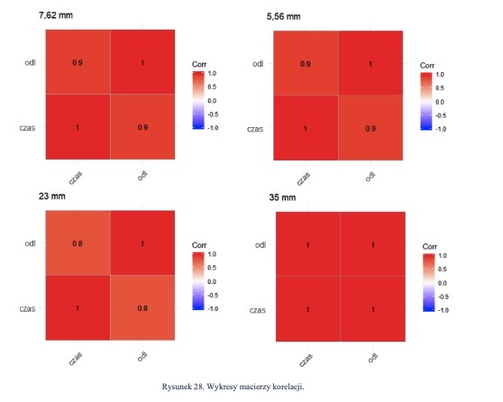
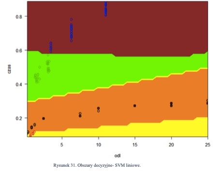

# praca_magisterska

## Informacje
Repezytorium jest poswiecone mojej pracy magisterskiej, wyroznionej w konkursie najlepszych prac dyplomowych w Wojskowej Akademii Technicznej
w 2020 r. Celem pracy jest porownanie i wybranie optymalnego klasyfikatora rozrozniajacego rodzaje pociskow, w zaleznosci wynikow pomiarow
fali akustycznej jaka generuja przeszywajac powietrze podczas lotu. W pracy zaimplementowano oraz opisano metody: liniowa i kwadratowa analize
dyskryminacyjna, regresje logistyczna, maszyne wektorow nosnych, naiwny klasyfikator Bayesa oraz K-najblizszych sasiadow.
Kod powstal w jezyku R w 2019-2020r., niezmieniony od tych lat.

## Pliki
- kod.R - kod programu
- bazadanych.csv - baza danych
- Praca_Final.pdf - praca magisterska

## Przykladowe rezultaty dzialania programu

